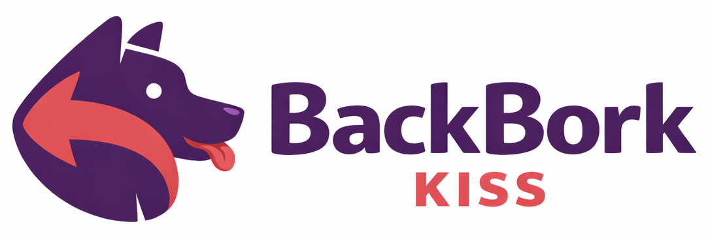

# 🛡️ BackBork KISS

### Disaster Recovery for WHM — The Simple Way



> [!NOTE]
> **Release Candidate** (v1.4.x) — Feedback is critical to BackBork's world domination plans.
> 
> We recommend testing in a non-production environment first. Bug reports and contributions welcome!

---

## 🤔 What is it?

BackBork wraps WHM's existing backup tools into a **clean interface**. No reinventing the wheel — just a nicer way to manage disaster recovery backups.

> **KISS** = Keep It Simple, Stupid

We've built this for sysadmins and resellers who want reliable account backups without having to opt for a flawed paid offering to get around the native backup limitations (ie. backs up all accounts _before_ transporting & deleting all, meaning disk allocations need to be 250-300%)

Select your accounts, pick a destination, backup/restore now or queue it. Done.

---

## ✨ Features at a Glance

| Feature | What It Does |
|---------|--------------|
| 📦 **Backup Accounts** | Full account backups to local or SFTP |
| 🔄 **Restore Accounts** | Full restore or cherry-pick specific parts |
| 📊 **Real-Time Progress** | Live step-by-step logging during backup/restore |
| ⏰ **Schedule Backups** | Hourly, daily, weekly (pick your day), or monthly (1st of month) |
| 🌐 **All Accounts Mode** | Dynamic schedules that auto-include new accounts |
| 🗂️ **Data Management** | Browse backups by account with size tracking |
| 🔒 **Schedule Lock** | Root can prevent resellers from managing schedules |
| 🗑️ **Deletion Lock** | Root can prevent resellers from deleting backups |
| 🗑️ **Bulk Delete** | Select and delete multiple backups at once |
| ⬇️ **Download Backups** | Download any backup direct to browser — local files served instantly, remote files staged with a 24-hour expiring token |
| 🗑️ **Retention Pruning** | Manifest-based per-schedule pruning (local and remote) |
| 👁️ **Destination Visibility** | Root can hide destinations from resellers |
| 🔄 **Destination Status** | View and re-enable disabled WHM destinations |
| 📧 **Notifications** | Email and Slack alerts when things happen |
| 🔥 **Hot DB Backups** | MariaDB-backup support (no table locks!) |
| 👥 **Multi-User** | Root and resellers, each with their own settings |
| 🛡️ **Cron Monitoring** | Self-checks with alerts if cron goes walkabout |
| 🔌 **JSON API** | Full REST-style API for automation and scripting |
| 🤖 **CLI Access** | Command-line API for Ansible/automation |
| 📝 **Audit Logs** | Filterable by account and action, with per-account runtimes |
| ⚙️ **22+ Skip Options** | Fine-tune exactly what gets backed up |
| 🔐 **Secure Permissions** | Backup archives created with chmod 600 |
| 🚀 **Update Notifications** | GUI alert when a new version is available |
| 🔄 **Self-Update** | One-click update from GUI with email/Slack notifications |
| ❌ **Job Cancellation** | Cancel running backups gracefully |

---

## 🚀 Quick Start

### Step 1: Install

> [!IMPORTANT]
> **Git clone is the only supported installation method.**
>
> This ensures commit tracking works correctly and you can easily update via `git pull`.
> Installing from a downloaded zip archive will show "Unofficial" in the footer and is not supported.

```bash
# Clone the repository
git clone https://github.com/The-Network-Crew/BackBork-KISS-for-WHM.git
cd BackBork-KISS-for-WHM

# Run the installer (as root)
./install.sh
```

**Updating an existing installation:**

```bash
cd /path/to/BackBork-KISS-for-WHM
git fetch origin && git reset --hard origin/main
./install.sh
```

This fetches the latest from GitHub and resets your local copy to match exactly. Any local modifications will be discarded.

Alternatively, use the **Self-Update** feature in the GUI (Settings tab) for one-click updates!

> [!NOTE]
> **Coming soon:** We're planning to add a CI system with automated tests closer to full release.

### Step 2: Configure a Destination (if you haven't already)

> [!WARNING]
> **Do this first!** BackBork reads destinations from WHM — it doesn't create them.

1. **WHM** → **Backup** → **Backup Configuration**
2. Scroll to **Additional Destinations**
3. Add SFTP (or use Local)
4. Click **Validate** ✅

### Step 3: Open BackBork

- **WHM** → **Backup** → **BackBork KISS**
- Or: `https://your-server:2087/cgi/backbork/index.php`

---

## 📸 Screenshots

### 📦 Backup Tab

Select your accounts, choose a destination, and fire off a backup. The interface shows you exactly what's happening in real-time with step-by-step progress logging — from pkgacct execution through to upload completion and cleanup. See the processing indicator (cog icon at the top) spin when the queue is being processed!


### 🔄 Restore Tab

Browse your backup files and restore entire accounts or just the bits you need. Real-time progress logging shows each step of the restore — download, verification, database handling, restorepkg execution, and cleanup. No more hunting through directories or wondering what's happening.


**Before restoration starts, you have to confirm:**


### ⏰ Schedules Tab

Set up automated backups on your terms — hourly, daily, weekly (pick your day), or monthly (runs on the 1st). The cron job handles the rest.


### 📋 Queue Tab

Monitor your backup jobs in real-time. See what's pending, what's running (with live progress bars showing accounts completed), and trigger manual processing when needed. Running jobs can be cancelled — they'll finish the current account backup, then stop gracefully.


### 🗂️ Data Tab

Browse backup files by account and manage your backup data. Select a destination, pick an account from the A-Z list (with storage size displayed for each), then delete or download individual backups. Local backups download instantly; remote backups are staged to a temporary location and served via a 24-hour expiring download link.


### 📝 Logs Tab

Every backup, restore, and config change is logged with timestamps, users, and IP addresses. Filter by account or action type for easy troubleshooting.

- **Operation Type**: Shows `backup_local`, `backup_remote`, `restore_local`, or `restore_remote`
- **Per-Account Runtime**: Each account shows its individual duration (e.g., `user1 (45s), user2 (1m 23s)`)
- **Destination Info**: Details include the destination name (local) or hostname (remote)
- **Filtering**: Filter logs by specific account or by action type


### ⚙️ Config Tab

Tweak your notification settings, database backup methods, and 22+ skip options. Each user (root/resellers) gets their own config.


**Example Notification: Slack**


**Example Notification: Email**


#### First, you need to create a Destination

> [!TIP]
> **This is done at WHM > Backup Configuration > Destinations.**
> 
> There is a hyperlink in BackBork KISS > Configuration that'll take you there.


Isn't it convenient how there's a JB up-sell there, and they won't fix Backups...

---

## 📖 How to get cracking!

### 🔹 Create a Backup

1. ✅ Select the account(s) you want to back up
2. 📍 Choose your destination (SFTP or local)
3. 🚀 Click **Backup Selected**
4. 👀 Watch the real-time progress log showing each step:
   - Destination validation
   - pkgacct execution
   - Database backup (if configured)
   - Upload to destination
   - Cleanup of temp files

### 🔹 Restore a Backup

1. Go to the **Restore** tab
2. Pick the destination, account, and backup file
3. Choose what to restore (full account or specific parts)
4. Click **Restore** and watch the real-time progress:
   - Download from remote (if applicable)
   - File verification
   - Database check
   - restorepkg execution
   - Cleanup and notification

### 🔹 Schedule Backups

1. Go to the **Schedule** tab
2. Click **Add Schedule**
3. Select accounts, destination, and frequency
   - Or enable **All Accounts** to dynamically include all accessible accounts
4. Save — the cron job handles the rest automatically

> [!TIP]
> Use different schedules for different account tiers. Back up your VIP customers hourly, regular accounts daily, and dormant sites weekly.

> [!TIP]
> Enable **All Accounts** for a schedule that automatically includes newly created accounts without manual updates.

---

## 👥 Who can use BackBork KISS?

| User Type | Access Level |
|-----------|--------------|
| 🔴 **Root** | All accounts, all settings, full control |
| 🟡 **Resellers** | Only their own accounts and settings |

Each user gets **separate configuration** — resellers can't peek at root's settings, or another reseller.

> [!NOTE]
> Resellers can see and use destinations but cannot create them. Root must configure destinations in WHM Backup Configuration first.

> [!NOTE]
> Root can enable **Schedule Lock** in Global Settings to prevent resellers from creating, editing, or deleting schedules. Existing schedules continue to run.

> [!NOTE]
> Root can enable **Deletion Lock** in Global Settings to prevent resellers from deleting backups. When enabled, resellers see an advisory notice and delete buttons are blocked at the API level.

---

## ⚙️ Available Config Options

| Setting | Description |
|---------|-------------|
| 🔒 **Schedule Lock** | (Root only) Prevent resellers from managing schedules |
| �️ **Deletion Lock** | (Root only) Prevent resellers from deleting backups |
| �🐛 **Debug Mode** | (Root only) Verbose logging to PHP error_log |
| 📧 **Email** | Where to send notification emails |
| 💬 **Slack Webhook** | Post alerts to your team's Slack channel |
| 🔔 **Notify On** | Start, success, and/or failure events |
| 🗄️ **Database Method** | mysqldump, mariadb-backup, or skip databases entirely |
| 📦 **Compression** | Compress backups or leave them raw |
| ⏭️ **Skip Options** | 22+ components you can exclude from backups |

---

## 📁 Where's Everything Stored?

```
/usr/local/cpanel/3rdparty/backbork/
├── 👤 users/        → Per-user config files
├── 📅 schedules/    → Scheduled backup jobs
├── 📋 queue/        → Jobs waiting to run
├── 🏃 running/      → Currently active jobs
├── ✅ completed/    → Finished job records
└── 📝 logs/         → Operation audit logs
```

> [!IMPORTANT]
> **Your actual backup files** go to whatever destination you've configured (local path or SFTP server). The plugin directory only stores job metadata and logs — not your backups themselves.

---

## 📋 System Requirements

| What | Minimum | Notes |
|------|---------|-------|
| WHM | 130+ | Needs modern WHMAPI1 |
| PHP | 8.2+ | Uses WHM's bundled PHP |
| Access | Root SSH | For installation only |
| Destination | SFTP or Local | Must be configured in WHM first |
| Cron | Required | Auto-configured by the installer |

> [!CAUTION]
> **Backup destinations must be configured in WHM before using BackBork.** The plugin reads existing destinations — it can't create them for you.

> [!NOTE]
> **Cron is essential** for scheduled backups and queue processing. The installer sets it up automatically, and the plugin monitors its health. See [CRON.md](CRON.md) for the nitty-gritty.

---

## 🔌 JSON API Access!

BackBork exposes a full JSON API for automation and scripting. Every action you can do in the GUI, you can do via API.

**HTTP (remote access):**
```bash
# Example: List accounts
curl -k -H "Authorization: whm root:YOUR_API_TOKEN" \
  "https://server:2087/cgi/backbork/api/router.php?action=get_accounts"

# Example: Queue a backup
curl -k -X POST \
  -H "Authorization: whm root:YOUR_API_TOKEN" \
  -H "Content-Type: application/json" \
  -d '{"accounts":["myuser"],"destination":"SFTP_Backup","schedule":"once"}' \
  "https://server:2087/cgi/backbork/api/router.php?action=queue_backup"
```

**CLI (local automation):**
```bash
# No auth needed — you're already root
php /usr/local/cpanel/whostmgr/docroot/cgi/backbork/api/router.php --action=get_accounts

# With JSON data
php router.php --action=create_schedule \
  --data='{"all_accounts":true,"destination":"SFTP_Backup","schedule":"daily","retention":30}'
```

| Endpoint | What It Does |
|----------|--------------|
| `get_accounts` | List accessible accounts |
| `get_destinations` | List configured backup destinations |
| `queue_backup` | Add accounts to backup queue |
| `create_schedule` | Create automated backup schedule |
| `update_schedule` | Update an existing schedule |
| `get_queue` | View queue, running jobs, and schedules |
| `get_logs` | Retrieve audit logs |

> [!TIP]
> See [API.md](API.md) for the complete endpoint reference, request/response formats, and authentication details.

---

## 🗑️ Uninstall (sad panda)

```bash
./uninstall.sh
```

Removes plugin files, cron entries, and WHM registration. **Your backups stay right where they are** — we don't touch those.

---

## 📚 More Documentation

| Resource | Description |
|----------|-------------|
| 🔧 [TECHNICAL.md](TECHNICAL.md) | Architecture, file structure, and internals |
| 🔌 [API.md](API.md) | Full API reference for automation |
| 🤖 [ORCH.md](ORCH.md) | Ansible playbooks and orchestration examples |
| ⏰ [CRON.md](CRON.md) | Cron configuration and troubleshooting |
| 🐛 [GitHub Issues](https://github.com/The-Network-Crew/BackBork-KISS-for-WHM/issues) | Report bugs or request features |
| 📜 [LICENSE](LICENSE) | Affero GPLv3 (AGPLv3) |

---

## ☁️ Need Off-Site Storage?

Got BackBork sorted but nowhere to send your backups? **[Velocity Host](https://velocityhost.com.au)** runs **KISS Cloud Storage** — purpose-built for blokes like us who want simple, secure, Aussie-hosted backup storage without the Big Tech nonsense.

| Why KISS Cloud? | |
|-----------------|---|
| 🇦🇺 **Data Sovereignty** | Your data stays in Australia, governed by local laws |
| 🔒 **No Snooping** | We don't scan your files to train AI or flog you ads |
| 💰 **Simple Pricing** | Per-GB, all-inclusive — no PhD required to read your invoice |
| 🛡️ **ZFS Integrity** | Monthly corruption checks on proper enterprise storage |

**BackBork KISS + KISS Cloud Storage** — a match made in heaven for your DR strategy.

👉 **[Check out KISS Cloud Storage](https://velocityhost.com.au/business-it-solutions/open-source-cloud-backup/)**

---

**Made with 💜 by [The Network Crew Pty Ltd](https://tnc.works) & [Velocity Host Pty Ltd](https://velocityhost.com.au)**
